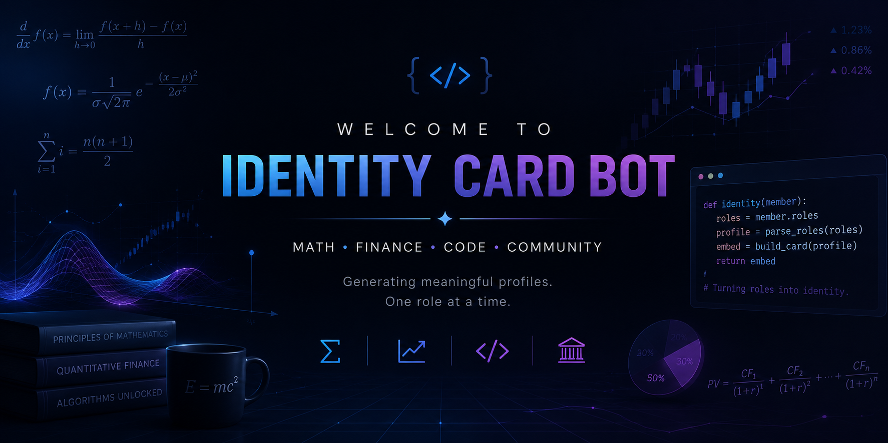

# Discord Multi-Bot Hub

<p align="center">
  
</p>

A collection of independent Discord bots hosted within a single Render service.

## Why this repository exists

Each Discord bot in this project is completely independent and could be deployed as its own application.

However, Render's free tier provides **750 instance hours per month**, which is effectively enough to keep **one** continuously running service online. Deploying five individual bots would quickly exhaust this allowance.

To make the most of the free hosting while keeping development simple, this repository groups multiple lightweight Discord bots into a single Python application. Each bot remains isolated inside its own directory with its own documentation, while sharing the same deployment, web server and hosting infrastructure.

This approach offers:

- 🚀 One Render deployment
- ❤️ One UptimeRobot monitor
- 🤖 Multiple independent Discord bots
- 📖 Separate documentation for every bot
- 🔧 Shared infrastructure with minimal duplicated code

---

# Repository Structure

```text
Discord-Multi-Bot/
│
├── assets/
│
├── bots/
│   ├── welcomer/
│   ├── kaggle/
│   ├── leetcode/
│   ├── moderation/
│   └── activity/
│
├── common/
│
├── main.py
├── requirements.txt
└── README.md
```

Each folder inside `bots/` contains a fully self-contained Discord bot.

Typically each bot contains:

```text
bot-name/
├── bot.py
├── README.md
└── __init__.py
```

This makes every bot easy to understand, develop, document and eventually extract into its own standalone repository if desired.

---

# Current Bots

| Bot | Description | Status |
|------|-------------|--------|
| Identity Card Welcomer | Generates permanent welcome cards from Discord roles. | ✅ |
| Kaggle Events | Announces new Kaggle competitions and events. | 🚧 Planned |
| LeetCode Challenge | Posts daily coding challenges. | 🚧 Planned |
| Activity Bot | Community engagement and scheduled events. | 🚧 Planned |
| Moderation Bot | Server moderation utilities. | 🚧 Planned |

---

# Shared Infrastructure

All bots share:

- Flask health-check server
- Render deployment
- UptimeRobot monitoring
- Python environment
- Dependency management

Each bot still uses its own:

- Discord Application
- Bot Token
- Slash commands
- Events
- Configuration
- Documentation

---

# Running

Create a virtual environment

```bash
python -m venv .venv
```

Activate it

Windows

```powershell
.venv\Scripts\activate
```

Linux/macOS

```bash
source .venv/bin/activate
```

Install dependencies

```bash
pip install -r requirements.txt
```

Start the application

```bash
python main.py
```

---

# Adding a New Bot

Simply create a new directory inside `bots/`

```text
bots/
└── my_new_bot/
    ├── bot.py
    ├── README.md
    └── __init__.py
```

Register the bot inside `main.py` and provide its Discord token as an environment variable.

---

# Goals

This repository aims to provide a clean, scalable architecture for hosting multiple lightweight Discord bots while remaining compatible with Render's free hosting tier.

Each bot is designed to remain modular, documented and portable, allowing it to be moved into its own repository in the future with minimal effort.

---

# License

Licensed under the MIT License.
