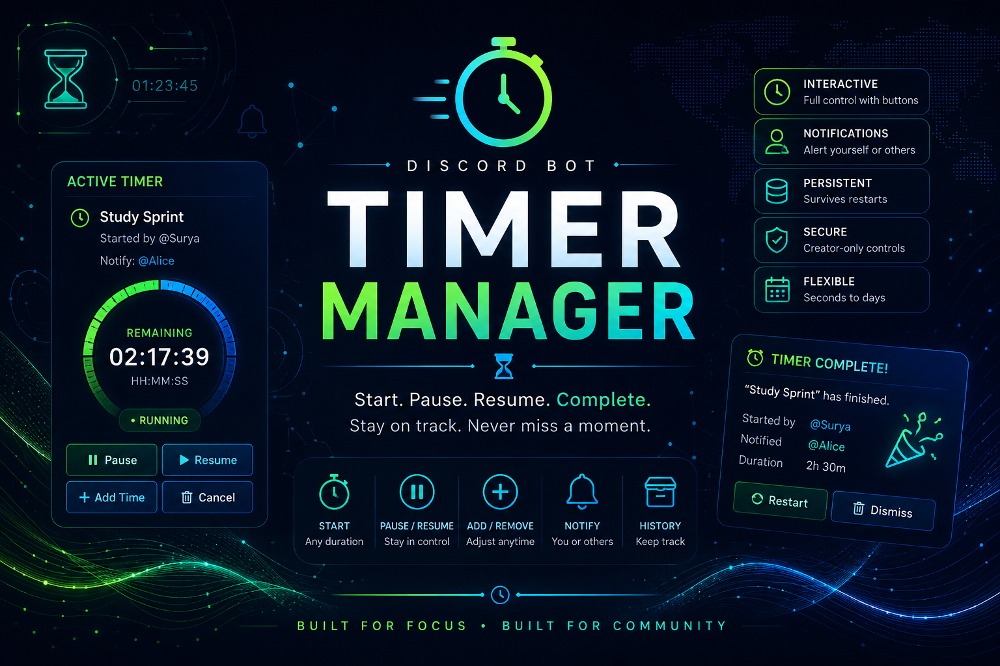

# ⏱️ Timer Manager

<p align="center">
  
</p>

Timer Manager is a lightweight Discord bot module for creating interactive countdown timers within the multi-bot hub.

Unlike simple `/timer 5m` commands, Timer Manager provides persistent, interactive timers that can be paused, resumed, extended, cancelled, and configured to notify other users when complete.

---

## Features

- Slash-command timer creation
- Human-readable durations (`30s`, `5m`, `1h 30m`, `2d`, etc.)
- Pause and resume timers
- Add or remove time after creation
- Cancel timers
- Optional timer labels
- Optional notifications for multiple Discord members and roles
- Interactive button controls
- Completion notifications
- Support for multiple concurrent timers

---

## Example

```text
/timer start duration:25m label:"Pomodoro" notify:@Alice @Bob @StudyGroup
```

Creates:

```
⏱️ Pomodoro

Status: Running
Remaining: 24m 59s

Started by: @Surya
Notify: @Alice @Bob @StudyGroup

[⏸ Pause] [➕ Add Time] [🛑 Cancel]
```

---

## Commands

```text
/timer start
/timer list
/timer status
/timer pause
/timer resume
/timer add
/timer cancel
```

---

## Design

Each timer stores:

- creator
- optional notification user
- channel
- message
- current status
- duration
- end timestamp (or remaining duration while paused)

Timers are designed around timestamps rather than continuously counting every second, allowing long-running timers with negligible CPU usage.

---

## Timer Display

The bot displays:

- current status
- remaining time
- finish time
- creator
- notification target

Discord's native relative timestamps are used where appropriate to minimise API requests while still providing a live countdown experience.

---

## Future Ideas

- Recurring timers
- Pomodoro mode
- Shared team timers
- Multiple notification reminders
- Timer history
- Personal timer dashboard
- Voice channel countdowns
